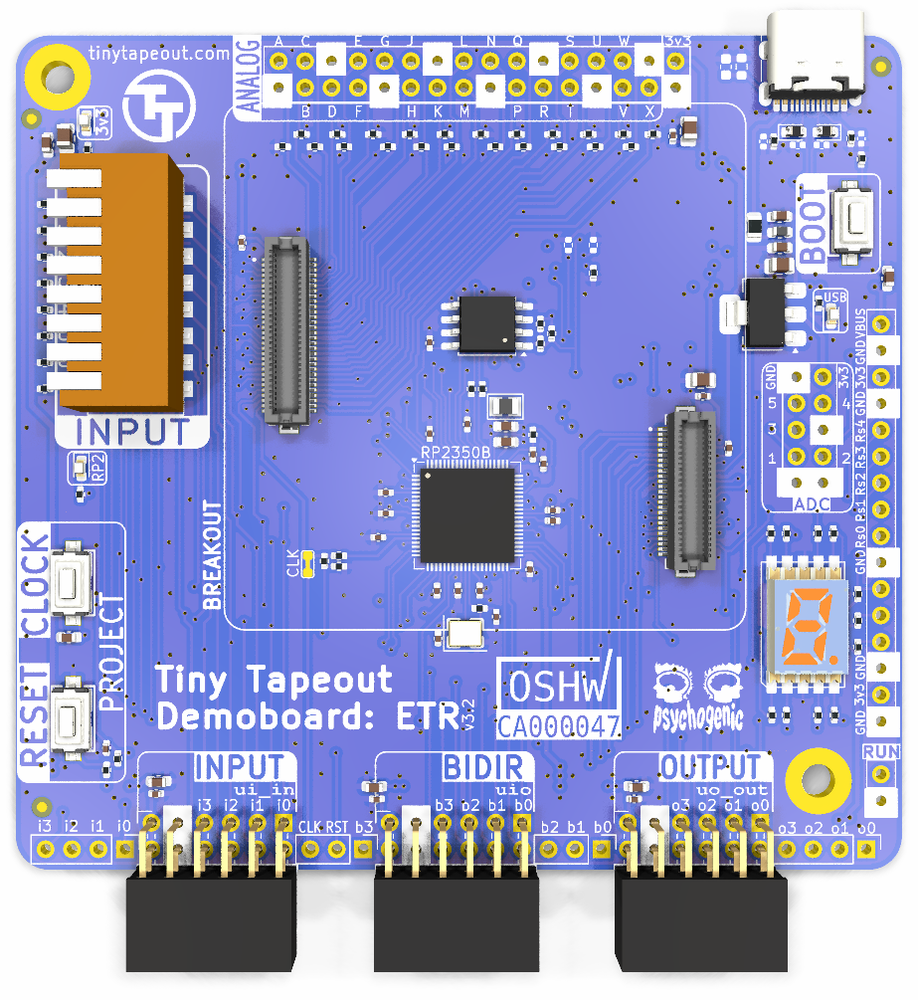
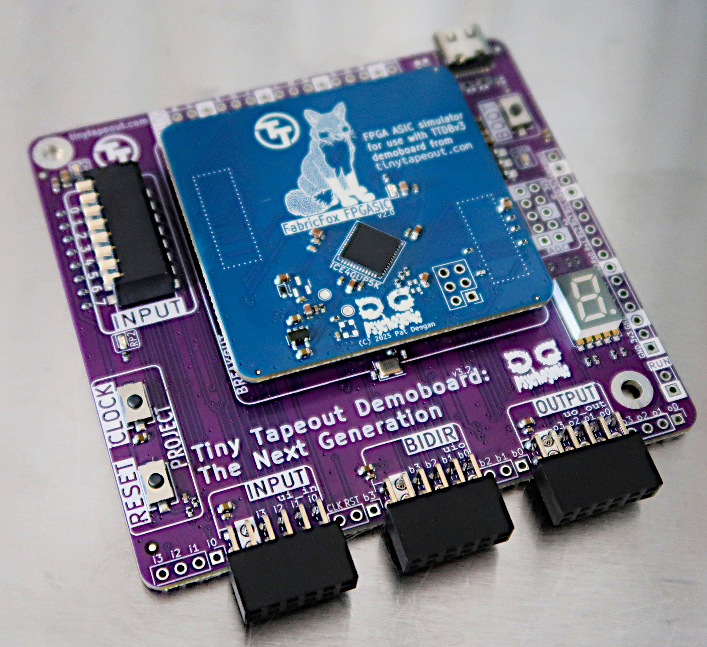
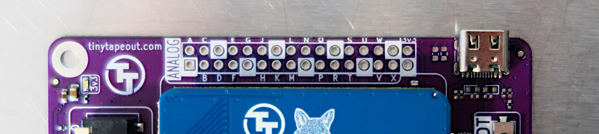
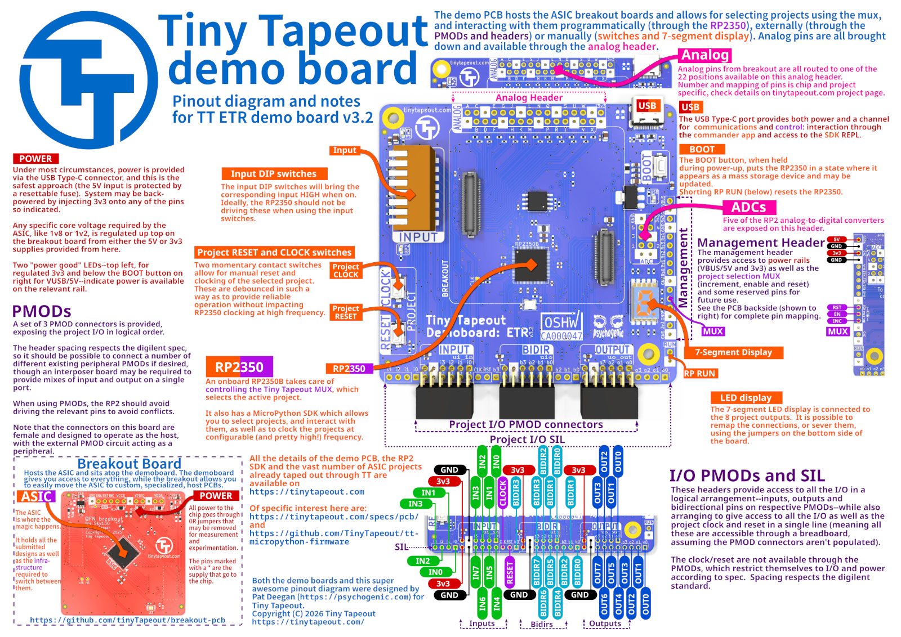
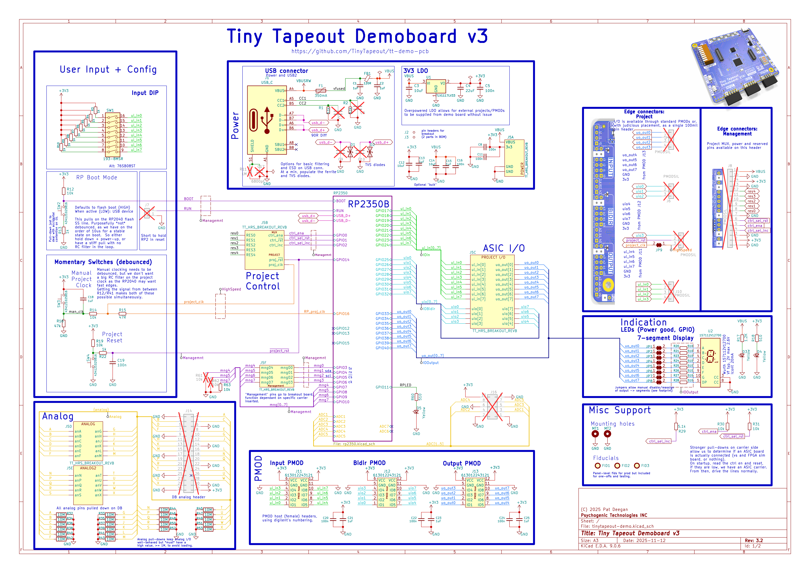

# TinyTapeout Demo Board

Demo board for TinyTapeout ASICs

These demonstration PCBs allow you to interact with [TinyTapeout](https://tinytapeout.com/) projects in 3 ways:

  * directly, using the input DIP switches and 7-segment display;
  * via breadboard or extension boards through PMODs; or
  * by interacting through the on-board RP2
  

In addition, since TT06, it is possible to create analog and mixed signal designs.  These signals are now available on a 100mil header directly on the demoboard

## Pinout Overview

### Previous Demoboard Versions

The details above are for the latest version of the demoboard.  To access leaflets and schematics for prior versions, see [here, in the historic documentation](doc/historic/README.md)

## Schematic and Function

The full schematic is available as a [PDF](doc/tt-etr-dbv3.pdf) but the gist of it is:

The RP2350 is responsible for selecting projects, by controlling the project MUX that's on the ASIC and, under most circumstances, providing the clock for the projects. It may, thereafter, interact with the design via it's connections to the input, output and bidirectional pins.

Another option is to use the various PMOD and pin headers to tie external circuitry to the design.  PMODs are provided in two varieties: straightforward I/O (where one PMOD is dedicated to each of in/out/bidir pins) and "standard" PMODs, that are mapped (mostly) according to specs to allow for SPI, I2C and UART extension boards to be plugged in (this assumes the project has been designed with this in mind, with I/O tasked accordingly). 

## PMODs

In addition with interfacing directly with projects via the RP2, extensions and interaction with the ASIC is possible through two sets of [PMODs](https://digilent.com/reference/_media/reference/pmod/pmod-interface-specification-1_2_0.pdf) on the demo boards.

The three on the bottom provide access to all the project I/O in a logical fashion, with inputs, bidirectional pins and outputs available on their own distinct headers.

This is nice and orderly and gives you access to all the pins, but extension boards will often need to span at least two, and sometimes three, distinct headers.

For interfacing peripheral modules, an interposer board was created (TODO: display and link) to provide more standard mixes of input and output on single PMODs.

## RP2 Pinout

| TT Pin    | RP2 Pin    | I2C      | SPI      | UART     |
| --------- | ---------- | -------- | -------- | -------- |
| reset     | GPIO14     |          |          |          |
| clock     | GPIO16     |          |          |          |
| ui_in[0]  | GPIO17     |          | SPI0.cs  |          |
| ui_in[1]  | GPIO18     |          | SPI0.sck |          |
| ui_in[2]  | GPIO19     |          | SPI0.tx  |          |
| ui_in[3]  | GPIO20     |          |          | UART1.tx |
| ui_in[4]  | GPIO21     |          | SPI0.cs  |          |
| ui_in[5]  | GPIO22     |          | SPI0.sck |          |
| ui_in[6]  | GPIO23     |          | SPI0.tx  | UART1.rts|
| ui_in[7]  | GPIO24     |          |          |          |
| uio[0]    | GPIO25     | I2C0.scl | SPI1.cs  | UART1.rx |
| uio[1]    | GPIO26     | I2C1.sda | SPI1.sck | UART1.cts|
| uio[2]    | GPIO27     | I2C1.scl | SPI1.tx  | UART0.rts|
| uio[3]    | GPIO28     | I2C0.sda | SPI1.rx  | UART0.tx |
| uio[4]    | GPIO29     | I2C0.scl | SPI1.cs  | UART0.rx |
| uio[5]    | GPIO30     | I2C1.sda | SPI1.sck | UART0.cts|
| uio[6]    | GPIO31     | I2C1.scl | SPI1.tx  | UART0.rts|
| uio[7]    | GPIO32     |          |          |          |
| uo_out[0] | GPIO33     |          |          | UART0.rx |
| uo_out[1] | GPIO34     |          |          | UART0.cts|
| uo_out[2] | GPIO35     |          |          |          |
| uo_out[3] | GPIO36     |          | SPI0.rx  |          |
| uo_out[4] | GPIO37     |          |          | UART1.rx |
| uo_out[5] | GPIO38     |          |          | UART1.cts|
| uo_out[6] | GPIO39     |          |          |          |
| uo_out[7] | GPIO40     |          | SPI0.rx  |          |

## Removing the ASIC breakout board

With the [Hirose DF12 Series](https://www.hirose.com/product/series/DF12) connectors now in use, removing breakouts from demoboards should be much more straightforward:

* Insert a finger on opposite diagonals (top left, bottom right)
* Gently pry upwards until the breakout pops off.

There are markings indicating where the actually connectors are placed, on the underside, on the breakouts.

## License

* The PCB is licensed under the [Apache2 License](LICENSE)
* The documentation is licensed under the [CC0](https://creativecommons.org/publicdomain/zero/1.0/)
* OSHWA registration [CA000047](https://certification.oshwa.org/ca000047.html)
